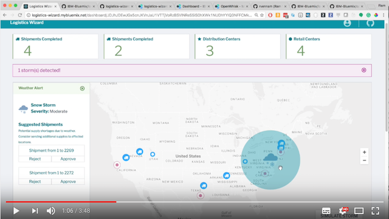
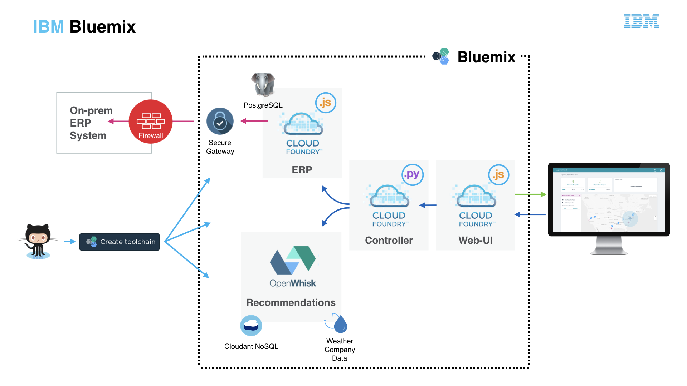

## Overview

This is the code for [this](https://youtu.be/vwor9Fva1V4) video on Youtube by Siraj Raval about Supply Chains. 

Logistics Wizard is a reimagined supply chain optimization system for the 21st century.

A number of companies use on-premises applications to run their supply chain business processes. [Enterprise Resource Planning](https://en.wikipedia.org/wiki/Enterprise_resource_planning) systems are often one of them and play a critical role in the daily operations.

Logistics Wizard aims to simulate an environment running an ERP system and augments this ERP system with applications to improve the visibility and agility of supply chain managers. In this case, the ERP system is a simulator implementing a very small subset of the functionalities of a real ERP system. The goal is to showcase several common SaaS implementation patterns. Logistics Wizard exhibits hybrid cloud, micro-services, and big data analytics concepts that can be reused when building enterprise-level applications on Bluemix.

One scenario, illustrating how a supply chain can be made more agile, involves dealing with a bad weather condition. Considering a global retail company with distribution centers, retail stores and ongoing shipments, how can this company adapt its supply chain to react to changing weather conditions that could impact its shipments or become opportunities to increase revenues.

## Try the Logistics Wizard sample

Use [this walkthrough](WALKTHROUGH.md) to view the application in action.

## Deploy Logistics Wizard in Bluemix

You can deploy your own environment in the following ways:
  1. Use the [Logistics Wizard Toolchain][toolchain_github_url] to deploy the application as Cloud Foundry microservices. (Recommended)
  2. Follow these [instructions](Deploy_Microservices_Cloud_Foundry_Docker.md) to deploy the ERP & Controller manually as Cloud Foundry **Docker** Apps.
  3. Learn more about deploying the ERP & Controller microservices using **Kubernetes** & **Istio** in this [blog](https://www.ibm.com/blogs/bluemix/2017/07/deploy-logistics-wizard-microservices-kubernetes-istio/).

## Architecture

The following projects are leveraged in the overall Logistics Wizard solution:

* [logistics-wizard-erp][erp_github_url] - defines the API used by the Logistics Wizard to access data from an ERP system. It also provides a default implementation to be used as a simulator. The simulator is a Node.js application connected to a PostgreSQL database. Through its API, it manages users (supply chain managers and retail store managers), distribution centers, retail stores and shipments.

* [logistics-wizard-webui][webui_github_url] - provides a dashboard to view ongoing shipments and alerts. There is no log-in or user credentials per se to use the deployed applications. Instead a unique demo ID is assigned to any new user trying the application. Behind each demo ID, Logistics Wizard creates an isolated environment with a default set of business users, distribution centers, retail stores, shipments. Refer to the [walkthrough](WALKTHROUGH.md) to get a tour of the capabilities.

* [logistics-wizard-recommendation][recommendation_github_url] - makes shipment recommendations based on weather conditions. It is a set of Bluemix OpenWhisk to retrieve current weather conditions and given a weather event to generate new shipment recommendations. These recommendations could then be turned into real orders.

* [logistics-wizard-controller][controller_github_url] - acts as the main controller for interaction between the services. It receives requests from the user interface and routes them to the ERP or the weather recommendation module.

Visit the [wiki](https://github.com/IBM-Cloud/logistics-wizard/wiki) for a detailed breakdown of the Logistics Wizard demo architecture and deployment strategy.

## Related Blog Posts, Videos, etc

- [Microservices on Bluemix: A multi-compute approach using Cloud Foundry and OpenWhisk](https://www.ibm.com/blogs/bluemix/2017/02/microservices-multi-compute-approach-using-cloud-foundry-openwhisk/)

- [Build a smarter supply chain with LoopBack](https://developer.ibm.com/bluemix/2016/07/11/building-smarter-supply-chain-developer-journey-loopback/)

- [Master continuous integration and delivery with the IBM Devops Toolchain](https://developer.ibm.com/bluemix/2016/08/09/master-continuous-integration-delivery-ibm-devops-toolchain/)

- [Using React and other technologies for Logistics Wizard UI](https://www.ibm.com/blogs/bluemix/2016/01/using-react/)

- [Old skills, new tricks: Unit testing OpenWhisk actions in a serverless world](https://www.ibm.com/blogs/bluemix/2016/12/unit-testing-openwhisk-actions-serverless-world/)

- [Deploy Logistics Wizard microservices with Kubernetes and Istio](https://www.ibm.com/blogs/bluemix/2017/07/deploy-logistics-wizard-microservices-kubernetes-istio/)

## Project Milestones

The GitHub milestones for this project and its children are managed by editing the [repository config](repository-config.json) file. The syntax is described in [this project](https://github.com/Jimdo/github-sync-labels-milestones). Modify the file and commit. Travis will take care of creating/updating the milestones.

## Contribute
Please check out our [Contributing Guidelines](.github/CONTRIBUTING.md) for detailed information on how you can lend a hand to the Logistics Wizard demo implementation effort.

## License

See [License.txt](License.txt) for license information.

| :point_down: Repositories ... Branches :point_right: | master | dev |
| --- | :--- | :--- |
| [logistics-wizard-erp][erp_github_url] |   |  |
| [logistics-wizard-controller][controller_github_url] |   |   |
| [logistics-wizard-recommendation][recommendation_github_url] |   |  |
| [logistics-wizard-webui][webui_github_url] |   |  |

<!--Links-->
[webui_github_url]: https://github.com/IBM-Cloud/logistics-wizard-webui
[controller_github_url]: https://github.com/IBM-Cloud/logistics-wizard-controller
[erp_github_url]: https://github.com/IBM-Cloud/logistics-wizard-erp
[recommendation_github_url]: https://github.com/IBM-Cloud/logistics-wizard-recommendation
[toolchain_github_url]: https://github.com/IBM-Cloud/logistics-wizard-toolchain

## Credits

Credit for the code goes to IBM. I've merely created a wrapper to get people started.
